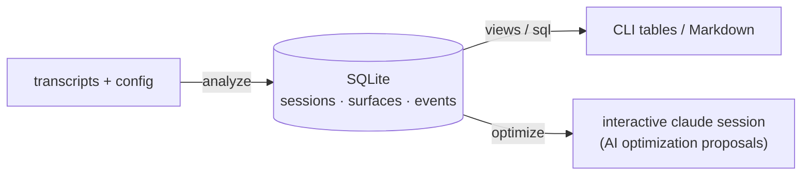
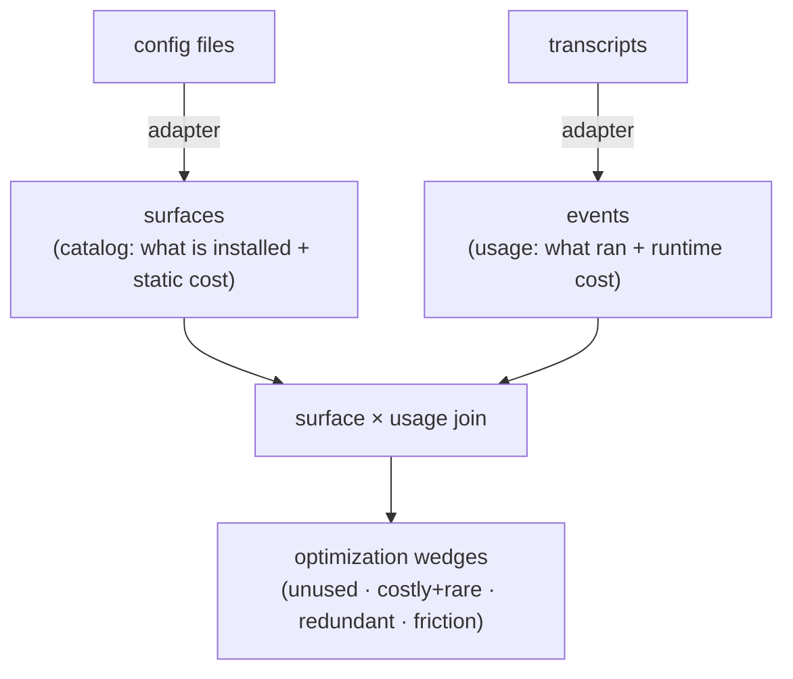
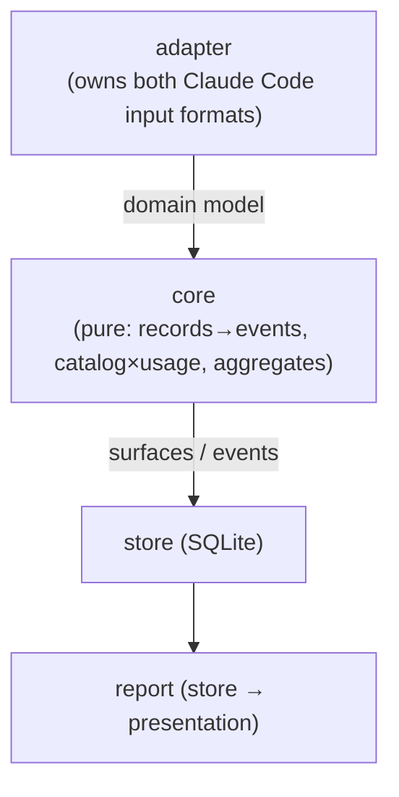

# Architecture Specification

cclens answers one question about a Claude Code setup: **where can the
configuration be optimized, and how?** It does that by measuring, from real
usage, the **cost** and **actual use** of every configuration surface — skills,
rules, hooks, MCP servers and their tool schemas, agents, `CLAUDE.md` /
`AGENTS.md` / memory, permissions — and surfacing the wedges between the two.

Skills are one surface among many. The tool is configuration-wide. AI-assisted
optimization *proposals* are a planned later layer; the core measures and
visualizes, it does not advise.

The design follows from three facts about the problem:

1. **Two inputs, both upstream-owned.** Cost and use cannot be read from one
   source. *What is installed and what it costs* comes from **live config**
   (skill/rule files, `settings.json`, MCP schemas); *what was actually used and
   at what runtime cost* comes from **session transcripts**. Both formats are
   Claude Code's, and both change between releases.
2. **The answer is a join, not a tally.** Optimization opportunities live in the
   gap between configured and used: installed-but-never-invoked, costly-but-rare,
   redundant. So the model must relate a catalog of surfaces to a log of usage.
3. **Re-parsing is expensive; analysis is iterative.** Hundreds of megabytes are
   read once into a compact store; every report (and the future AI layer) reads
   the store.

## Two stages

- **`analyze`** reads both inputs and writes the normalized store. The verb is
  `analyze` (not `build`): the command *analyzes* raw input into facts, it does
  not build an artifact.
- **The read commands** — the curated views and the arbitrary-query `sql` —
  query the store and render. See `cli.md`.

The stages are decoupled *only* by the store. The read commands' **rendering**
never reads raw input; `analyze` never renders. But the stages **compose**: a
view runs the incremental `analyze` stage first by default (`cli.md`
`--frozen`), the way `optimize` always has — otherwise the store silently goes
stale and the user cannot notice. Composition is stage-before-stage, not a leak:
the view's queries still see only the store. Consumers read the same store. Two
were anticipated, and shape what `analyze` must capture:

- **Optimization proposals** — turning the findings into concrete advice. This
  is realized by `optimize` (`cli.md`): it composes the headline findings with a
  prescribed advisor prompt and hands them to an interactive `claude` session.
  The prompt composition is a pure transform (`core::optimize`); only the process
  launch is I/O. It reads aggregates; it needs nothing the store does not already
  hold.
- **Skill extraction** — clustering recurring user prompts into candidate new
  skills (the "synthesize a new surface" goal, distinct from pruning existing
  ones). This needs the **raw prompt text**, which the store does not keep — so
  `analyze` records a pointer to it now (`events.prompt` → `(source_path,
  source_line)`; `storage.md`). The capability is reserved, not built: transcripts
  rotate, and the text is unrecoverable once gone, so the cheap pointer is laid
  down today even though the consumer is later.

## The central model: catalog × usage

- A **surface** is one configurable thing (a skill, a rule, an MCP server, …)
  with a **static cost** — the token weight of its definition, measured by
  reading the config file. See `surfaces.md` and `config-format.md`.
- An **event** is one timestamped occurrence with a **runtime cost** (tokens,
  context growth, duration). A skill invocation is one event kind among many.
  See `events.md` and `session-format.md`.
- A surface with no matching events is unused; a surface whose static cost is
  high but whose events are few is a prune candidate. The join is the product.

## Layers

Inside `analyze`, knowledge is stratified so an upstream format change lands in
exactly one layer.

| Layer | Owns | Must NOT know |
| --- | --- | --- |
| **adapter** | The raw shapes of *both* inputs: transcript JSONL (record types, field names, `subagents/` layout) and config files (skill/rule frontmatter, `settings.json`, MCP schemas, `CLAUDE.md`). Maps them into the internal domain model. | The SQLite schema; how costs are computed. |
| **core** | Event extraction, static-cost weighing inputs, the catalog×usage join, and aggregation — all **pure functions** over the domain model. No I/O, no clock, no DB. | Claude Code field names or config path conventions; SQL. |
| **store** | Persisting and querying `sessions` / `surfaces` / `events` in SQLite. | Raw input shapes. |
| **report** | Turning query results into tables / Markdown and ranking wedges. | Raw input shapes; SQL beyond the store's API. |

The contract between adapter and everything else is the **internal domain
model** — tool-centric names stable across Claude Code releases. Renaming an
upstream field or moving a config file changes the adapter's mapping, nothing
downstream. This boundary is enforced by `.claude/rules/format-isolation.md`; a
format change whose diff escapes the adapter is a boundary bug.

### Why a pure core

The tool's value is its analysis logic — event boundaries, the compaction-safe
context metric, subagent attribution, the catalog×usage join. That logic is
where bugs hide and where the specs make the most claims, so it must be
exhaustively unit-testable. Keeping it free of I/O, clocks, and SQL lets every
rule be driven by a small synthetic fixture (`.claude/rules/tdd.md`). File
walking, reading, tokenizing, SQLite, and "now" are thin shells; non-determinism
(current time, timezone, tuning constants) is injected.

## Forward compatibility

The adapter deserializes defensively: it reads only the fields the tool needs,
ignores unknown fields, tolerates missing optional ones. A new Claude Code field
or config key must never break `analyze`. The concrete shapes the adapter
depends on — and which are most likely to drift — are catalogued in
`session-format.md` (transcripts) and `config-format.md` (config).

## What this tool deliberately is not

- **Not a live monitor.** It analyzes inputs at rest, not a running session.
- **Not a billing tool.** Token counts rank surfaces; they are not an accounting
  ledger. Approximations (estimated subagent attribution, tokenizer-based static
  cost) are acceptable and flagged, not avoided.
- **Not an advisor (yet).** The core reports opportunities; turning them into
  concrete proposals is the future AI layer's job.
- **Not a data store.** Raw transcripts and config stay where Claude Code put
  them; the tool reads them read-only and never copies them into the repo or the
  store (`.claude/rules/session-data-privacy.md`).
