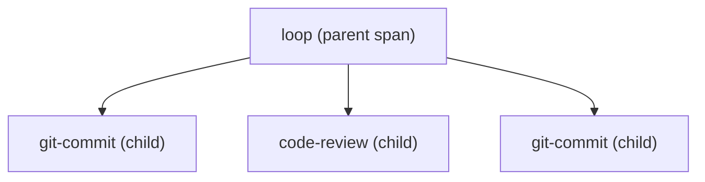

# Events Specification

An **event** is one timestamped occurrence the tool extracts from a transcript,
carrying a runtime cost and pointing at the configuration surface it exercises.
Events are the usage half of the catalog×usage model (`architecture.md`). This
spec defines the event kinds, how a *span* (an event with a duration window) is
bounded, how each cost metric is computed, and how two hard cases — context
compaction and meta-skills that drive other skills — are handled. All of it is
**pure** logic over the domain model the adapter produces; it is the tool's
primary test surface (`.claude/rules/tdd.md`).

## Event kinds

Every event has a `kind` and, where applicable, a `surface_kind` / `surface_id`
identifying the configuration surface it exercises (the join key into
`surfaces.md`).

| `kind` | Surface exercised | Span? |
| --- | --- | --- |
| `skill_invocation` | `skill` | yes — work window until the skill's activity ends |
| `agent_spawn` | `agent` | the subagent's lifetime (cost attributed via `promptId`) |
| `tool_use` | `mcp_tool` / `mcp_server` / built-in tool | point event |
| `prompt` | — (user input; raw material for skill extraction) | point event; text referenced, not stored |
| `compaction` | — (a `compact_boundary`) | point marker, used by the context metric |
| `permission_prompt` | `permission` | point event (friction signal) — heuristic source |

New kinds are added additively as the adapter learns to recognise new signals
(`session-format.md`); the schema's loose `kind` / `surface_*` columns
(`storage.md`) absorb them without migration.

Two kinds carry caveats that downstream reports must honour:

- **`prompt`** stores a pointer `(source_path, source_line)` to the raw record,
  not the prompt text — the text is recovered on demand by the future
  skill-extraction layer, keeping personal data out of the store (`storage.md`,
  `.claude/rules/session-data-privacy.md`). This reserves the
  prompt-clustering capability now so it survives transcript rotation.
- **`permission_prompt`** has **no structured transcript record**; it is
  extracted heuristically from denial text inside `tool_result` error blocks
  (`session-format.md`). It is therefore lower-confidence than the structurally
  detected kinds, and the friction wedge built on it (`surfaces.md`) is labelled
  as such.

Surfaces that emit no event at all — `rule`, `hook`, `claude_md` — never produce
rows here. That is expected, not missing data; `surfaces.md` classifies them as
catalog-only so their absence of events is never read as disuse.

A **span** is an event with a duration window — currently `skill_invocation`.
The rest of this spec is mostly about spans, since that is where boundary and
attribution subtlety lives. Point events carry only an instant and their own
cost.

## Span boundaries

A span starts at its invocation. It ends at the **earliest** of:

1. the next **human turn** in the session;
2. the next **sibling** invocation (an invocation that is not a child of this
   span — see meta-skills below);
3. a record following an **idle gap** longer than `IDLE_GAP` from the previous
   record (active work has ended);
4. the **end of the session**.

Rules 2–4 exist because rule 1 alone is insufficient. The naive definition
(end = next human turn only) let a span run to the end of the session whenever no
human turn followed, sweeping in unrelated tokens — observed: a `doc-check` span
absorbing ~580k output tokens of later, unrelated work. Rules 2 and 3 close the
span at the next real boundary; rule 4 bounds the trailing case. A span closed
only by rule 4 has a `duration_sec` that is a lower bound (the session may have
ended mid-work), so reports flag trailing spans rather than trusting their
wall-clock.

`IDLE_GAP` is a tuning constant injected into the core (not hard-wired), so
tests pin it.

## Meta-skills and nesting

Some skills drive other skills (`loop` repeatedly invokes `git-commit`,
`code-review`, …). If the sibling rule (boundary rule 2) fired on those inner
calls, the `loop` span would close at its first child and report ~zero cost
while the children absorbed everything — inverting reality, since `loop` is the
driver.

So an invocation that occurs **inside** an open span is that span's **child**,
not a sibling: it does not close the parent. Each span records `parent_id` (NULL
at top level). A child is an invocation that begins while an ancestor span is
still open — nesting depth in the run, not just a shared `promptId`.

Because a parent's totals overlap its children's, every report must state whether
a figure is **parent-inclusive** or **parent-exclusive** — otherwise meta-skill
cost is silently double-counted.

## Metrics

Each metric is computed from the records strictly within the event/span.

| Metric | Definition |
| --- | --- |
| `out_tokens` | Sum of `output_tokens` over the span's `assistant` records. |
| `ctx_growth` | **Compaction-safe** context consumption: the sum of *positive* differences in prompt size between consecutive `assistant` records. Decreases (compaction, cache eviction) are clipped to zero. |
| `ctx_start` | Prompt size at the first `assistant` record. |
| `ctx_peak` | Maximum prompt size across the span's `assistant` records. |
| `duration_sec` | Last minus first record `timestamp` within the span. Zero when fewer than two timestamped records. |
| `sub_tokens` | Tokens from subagents attributed to this span (below). |
| `sub_agent_count` | Number of subagents attributed. |
| `sub_tokens_estimated` | True when any attributed subagent was equally split (below). |
| `model` | Representative model: the first `assistant` record whose model is **not** `<synthetic>`. NULL if none qualifies. |

### Why `ctx_growth`, not max-minus-start

The intuitive "context consumed" is `ctx_peak − ctx_start`, but prompt size is
not monotonic: when a session compacts (observed ~1,000,000 → ~49,000 within one
file, marked by a `compact_boundary` record — `session-format.md`), `ctx_peak`
keeps crediting the pre-compaction peak long after that context was released, and
a span opening just after a peak can show a near-zero or negative figure. Summing
only the positive step-to-step increments counts what the span actually *added*
to the running context and is robust to mid-span compaction. `ctx_start` and
`ctx_peak` are stored alongside so the raw shape stays inspectable and
`ctx_growth` is auditable rather than opaque. The `compact_boundary` markers may
additionally be used to split or annotate a span; at minimum the metric must not
assume monotonic prompt size.

## Subagent attribution

A span's `sub_tokens` is the cost of subagents it spawned, joined by `promptId`
(`session-format.md`). Because several subagents can share one `promptId` and a
turn can contain more than one span that spawned subagents, the join is not
always one-to-one.

- A subagent is attributed to the span containing the `Agent` spawn for its
  `promptId`.
- When more than one span in the same `promptId` competes for the same
  subagents, their tokens are **split equally** across the competing spans.
- Any span whose `sub_tokens` includes an equally-split (not cleanly
  attributable) subagent is marked `sub_tokens_estimated`. Equal-split is a
  deliberate approximation — this tool ranks, it does not bill
  (`architecture.md`) — and the flag lets reports separate exact figures from
  estimates rather than hiding the uncertainty.

The worst-case error of equal-split is bounded by the spread of the competing
subagents' sizes; the flag, not false precision, is the mitigation.

## Determinism

The core takes the session's records plus tuning constants (`IDLE_GAP`) and
returns events with no hidden inputs — no clock reads, no randomness. Identical
records in always produce identical events out, so every rule above is pinned by
a fixture test.
